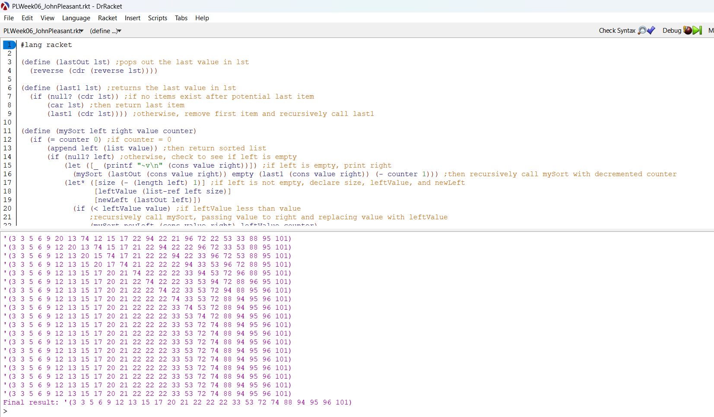

# Racket Recursive Sorting

This project implements a custom recursive sorting algorithm in Racket using functional decomposition and list-processing helpers.

The program demonstrates recursive problem solving without relying on built-in sorting functions.

---

## Features

* Recursive extraction of the last list element
* Recursive removal of the last list element
* Custom recursive sorting procedure
* Functional list processing without mutation

---

## Concepts Demonstrated

* Functional programming
* Recursive decomposition
* List traversal
* State passing through recursion
* Algorithmic thinking

---

## Project Structure

```text id="zuh5bg"
racket-recursive-sorting
│
├── recursive_sort.rkt
└── README.md
```

---

## How to Run

Open in DrRacket and run the file.

Or from terminal:

```bash id="85v4fe"
racket recursive_sort.rkt
```

---

## Example Output



---

## Author

John Pleasant
Computer Science Student
